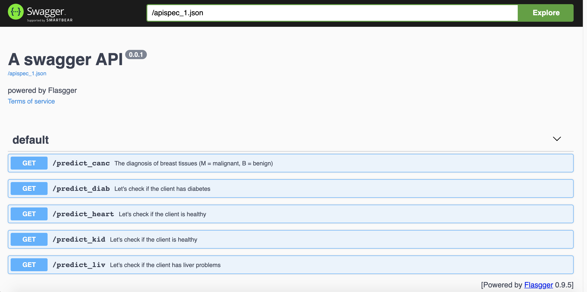
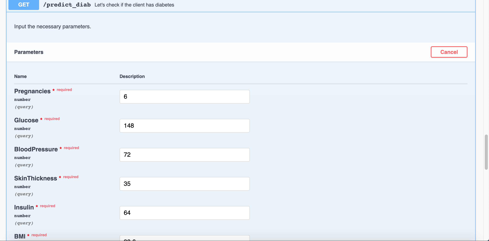
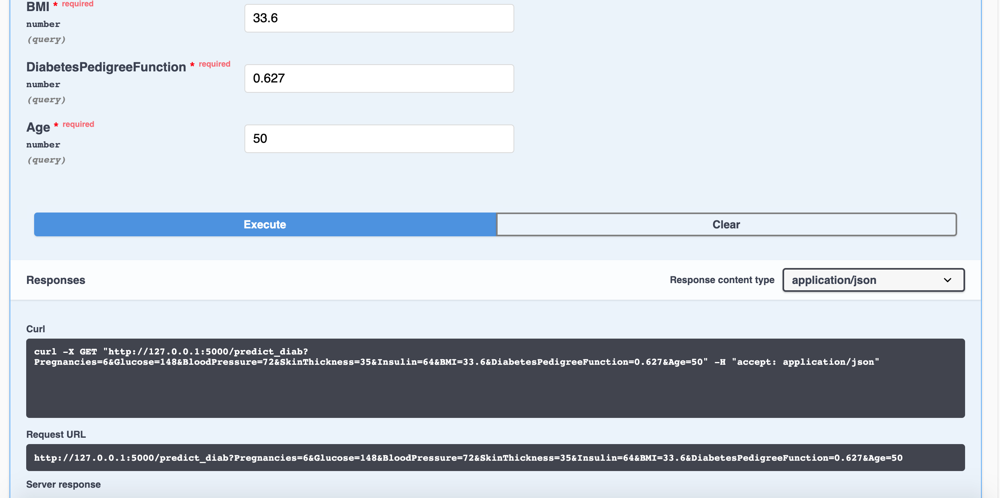
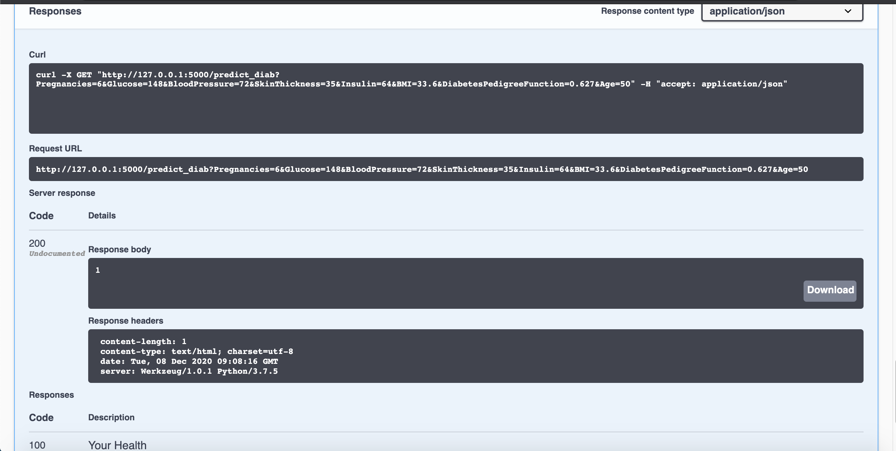

# Health

This project is an end to end data science project that is able to predict if the client suffers from any disease or not.

# Dataset Used

Breast Cancer: Winconsin Breast Cancer Dataset
Diabetes: Pima Indian Diabetes Dataset
Liver: Indian Patient Liver Records
Heart: Heart Disease Dataset
Kidney: Chronic Kidney Disease Dataset

# Libraries Used:
Sci-kit Learn
Flask
Pandas
Numpy
Flasgger 

# Interface

