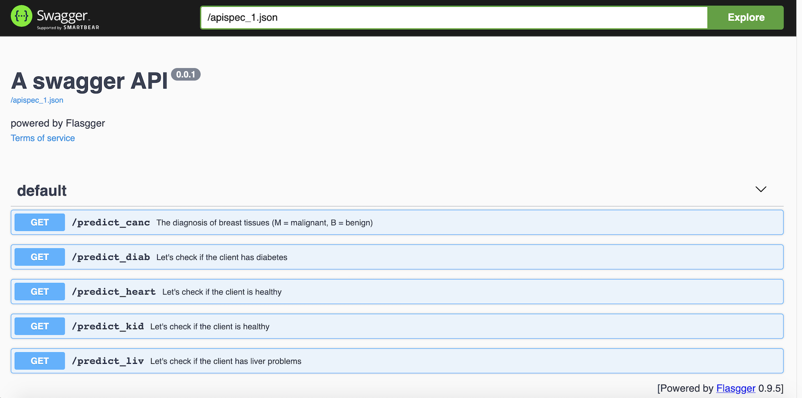

# doctor

This project is an end to end data science project that is able to predict if the client suffers from any disease or not.

# data used

Breast Cancer: Winconsin Breast Cancer Dataset 
Diabetes: Pima Indian Diabetes Dataset 
Liver: Indian Patient Liver Records 
Heart: Heart Disease Dataset 
Kidney: Chronic Kidney Disease Dataset 

# libraries used:
Sci-kit Learn 
Flask 
Pandas 
Numpy 
Flasgger  

# interface

